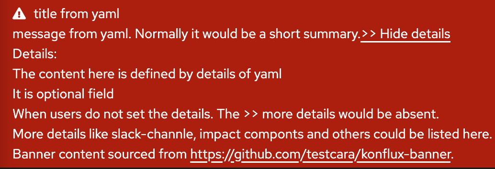

# 🔔 Konflux Banner Repository


This repository manages **banner notifications** for the [Konflux](https://konflux.pages.redhat.com/docs/users/index.html).
Use it to **add**, **edit**, or **remove** banners related to **upcoming shutdowns**, **service degradation**, etc.

When a banner file is updated, ArgoCD automatically and in real time triggers a sync to update the corresponding ConfigMap in the target cluster.
The Konflux frontend reads banner content from this ConfigMap and displays it in the UI.

Each cluster only processes its own banner file.

---

## 📝 Format

Each banner must be stored in **its own YAML file**, and adhere to the format below:

```yaml
enable: true
title: Scheduled Maintenance Notification
message: The Konflux platform will undergo scheduled maintenance tonight. Temporary service interruptions may occur.
type: warning
startTime: "2025-05-15T21:00:00Z"
endTime: "2025-05-15T23:00:00Z"
details: |
  Details:
  - Maintenance window: May 15, 2025 from 21:00 to 23:00 UTC
  - Impact Component: Konflux UI, MintMaker
  - Contact: Please reach out via the #konflux-support Slack channel for assistance

  Thank you for your understanding and support.
```

### Fields

| Field       | Type    | Required | Description                                                      |
|-------------|---------|----------|------------------------------------------------------------------|
| `enable`    | boolean | ✅       | Whether to enable the banner (true or false, lowercase preferred)|
| `title`     | string  | ✅       | A brief header summarizing the banner's purpose                 |
| `message`   | string  | ✅       | Text shown to users in the banner                               |
| `type`      | string  | ✅       | Visual severity: `info`, `warning`, or `danger` affecting background color and icon              |
| `startTime` | string  | ❌       | When the banner becomes active (UTC, ISO 8601 format)           |
| `endTime`   | string  | ❌       | When the banner disappears automatically (UTC, ISO 8601 format) |
| `details`   | string  | ❌       | More details like: issues, Slack channels, etc.                 |

More details about certain fields:  

- Optional fields like `startTime`, `endTime`, and `details` should be included only when needed. If unused, omit them completely to avoid schema validation errors. 
- Time values must follow the ISO 8601 UTC format.
- The `details` field is a plain string but supports Markdown syntax (rather than raw HTML) to enhance readability and display in the UI.

### UI Preview

The following are two visual examples of how these fields are rendered in the UI when 'enable' is true.
Field values (such as `title` and `message`) are placeholders used to demonstrate how YAML fields map to the UI.

Examples:

<p align="left">  <br/>  </p>

What the examples show:

- `title` and `message` are shown as-is. 
- `type` sets the banner color (danger: red, info: blue, warning: yellow); 
- `startTime` and `endTime` are invisible but control display time.
- `details` is shown conditionally if provided.

## 🗂 Directory Structure

```yaml
clusters
├── production
│   ├── kflux-ocp-p01.yaml
│   ├── kflux-prd-rh02.yaml
│   ├── stone-prd-rh01.yaml
│   ├── stone-prod-p01.yaml
│   └── stone-prod-p02.yaml
└── staging
    ├── stone-stage-p01.yaml
    └── stone-stg-rh01.yaml
```

- production/ and staging/: Represent different environments.

- Each YAML file maps to a specific Konflux cluster, as referenced the [UI versions](https://konflux.pages.redhat.com/docs/users/getting-started/ui-versions.html) page.

## ✅ How It Works

1. **Cluster-Specific Banner Files (User-Facing)**

    Each cluster has its own banner file located in the ```clusters/``` directory
    (e.g., clusters/production/stone-prod-p01.yaml).
    These files are symbolic links pointing to the actual content files maintained under the ```deploy/``` directory, so that users can edit banner content easily without interacting with infrastructure configuration.

2. **Kustomize-Based Resource Configuration**

    The ```deploy/``` directory is the source of truth and contains the actual banner YAML files as well as Kustomize configurations used to generate Kubernetes ConfigMaps.
    Each cluster has its own Kustomize overlay or configuration under deploy/, and ArgoCD apps are set up per cluster to monitor the corresponding Kustomize output.
    When banner content changes (even through symbolic links), ArgoCD detects the updates and triggers a sync, generating a new ConfigMap for the cluster.

3. **Displaying Banners in the UI**

    The Konflux frontend continuously polls the ConfigMap deployed in the cluster.
    It reads and displays the banner content based on the configured startTime and endTime.
    If these fields are omitted, the banner is shown immediately and remains visible until updated or removed.

4. **Seamless Workflow for Users**

    Users only need to modify the banner YAMLs in the clusters/ directory.  
    Behind the scenes, the changes are propagated via symbolic links to the deploy/ directory, where they are picked up by ArgoCD.
    No infra knowledge or deployment steps are required from the user — banner updates are reflected in the UI automatically and in real time after a simple PR merge.

## 🔎 YAML Validation

All banner YAML files under the clusters/ directory are validated to ensure correctness, consistency, and safety before being accepted.

Validation includes:

- File type check — Only .yaml files are allowed (no .yml or other formats)
- Schema validation — Ensures each banner file contains all required fields and correct types, based on a predefined JSON schema
- Content safety — Verifies that summary and details fields do not contain unsafe or unsupported content
- Symlink enforcement — Each file under clusters/ must be a symbolic link pointing to a corresponding file under deploy/; direct (non-symlink) YAML files are not allowed
- Kustomize build validation — Ensures all Kustomize configurations under deploy/ can be successfully built using kustomize build, producing valid Kubernetes manifests

These validations help maintain consistency across clusters, prevent misconfiguration, and ensure that ArgoCD can successfully pick up and sync banner updates.

### CI Validation (GitHub Actions)

On every push or pull request involving `clusters/**/*.yaml`, GitHub Actions will automatically run all
validation checks with read-only permissions. The workflow file is locationed at `.github/workflows/validate-banner.yaml`.

To help demonstrate the logic, here are example pull requests that illustrate both valid and invalid cases:

✅ Valid Examples:

- ✅ [PR #4](https://github.com/testcara/konflux-banner/pull/4) – Valid Example 1: vaild banner content with all schema fileds
- ✅ [PR #5](https://github.com/testcara/konflux-banner/pull/5) – Valid Example 2: vaild banner content without time or details shema fields.
- ✅ [PR #7](https://github.com/testcara/konflux-banner/pull/7) - Vaild Example 3: new valid banner content for new clusters

❌ Invalid Examples:

- ❌ [PR #2](https://github.com/testcara/konflux-banner/pull/2) – Invalid Example 1: invalid banner content with invalid schema
- ❌ [PR #3](https://github.com/testcara/konflux-banner/pull/3) – Invalid Example 2: invalid banner content with improper HTML code.
- ❌ [PR #8](https://github.com/testcara/konflux-banner/pull/8) – Invalid Example 3: invalid new banner content without updating the deploy real content.

### Local Validation (Recommended Before Push)

#### Prerequisites

To run the YAML schema validator locally, ensure you have the following tool installed:

- `make`– for running the validation targets
- `go` – the Go programming language (version 1.20+ recommended)
- `kustomize` – for building Kubernetes overlays

Example install commands:

```bash
# macOS (via Homebrew)
brew install go kustomize

# Ubuntu/Debian
sudo apt-get update
sudo apt-get install golang kustomize

# Fedora/CentOS/RHEL
sudo dnf install golang kustomize
```

#### ✅ What’s Checked

Running make all will perform the following validations:

- File Extension Check – Ensures no .yml files are used (only .yaml is allowed)
- Symlink Check – Validates that all .yaml files in clusters/ are symbolic links pointing to    corresponding files in deploy/
- Kustomize Validation – Confirms that every Kustomize overlay in deploy/ can be successfully built
- Schema + Content Validation – Compiles and runs the Go-based schema validator to ensure banner content is safe and structurally correct

#### ▶ Run Validations Locally

```bash
# Check if your environment is ready
make check-prereqs

# Run all validation steps
make all
```

## ✍️ Contributing

1. **Fork this repository**  
    If you haven't already, fork this repository to your own GitHub account.

2. **Create a new branch**  
    Create a branch for your changes. For example:

    ```bash
    git checkout -b update-banner
    ```

3. **Create/Update a YAML file**  
   - Locate the appropriate directory under clusters/staging/ or clusters/production/.
   - Update an existing banner by editing the .yaml file.
   - Add a new banner by creating a new .yaml file via symlink to the target location in deploy/.
    ⚠️ All banner files under clusters/ must be symbolic links pointing to files under deploy/. Direct .yaml files are not allowed.

    If you're adding a banner for a new cluster, you will also need to submit a Pull Request to the `infra-deployments` repo to register the new cluster's Kustomize overlay.

4. **(Optional) Validate Locally**  

    ```bash
    make all
    ```

5. **Commit your changes**  
    Commit your changes with a descriptive commit message. For example:

    ```bash
    git commit -m "Add new downtime banner for staging"
    ```

6. **Push your changes**  
    Push your changes to your forked repository:

    ```bash
    git push origin update-banner
    ```

7. **Create a Pull Request**  
    Open a Pull Request from your branch to the main branch of the original repository.
    Provide a clear description of your changes in the Pull Request.

8. **Review & Merge**  
    A reviewer will review your Pull Request. Once approved, your changes will be merged and automatically synced with the correct cluster.
